For the given code below:

- create the execution context diagram
- re-write the code in ways that system will understand/interprete

1.

```js
var username = 'Arya';
let brothers = ['John', 'Ryan', 'Bran'];

console.log(username, brothers[0]);

sayHello = function;

let message = sayHello(username);
var nextMessage = sayHello('Test');
```
```js
// Declaration Phase
username = undefined;
brothers;

function sayHello(name) {
  return `Hello ${name}`;
}

message;
nextMessage = undefined;

// Execution Phase
username = "Arya";
brothers = ['John', 'Ryan', 'Bran'];

    // FEC (console.log)
    log "Arya" "John"

message = sayHello function call;

    // FEC (sayHello) (DP)
    var name = undefined;

    //FEC (sayHello) (EP)
    name = "Arya"
message = "Hello Arya"

nextMessage = sayHello('Test');
    //FEC (sayHello) (DP)
    var name = undefined;
    // FEC (sayHello) (EP)
    name = "Test"
nextMessage = "Hello Test"

console.log(username, brothers[0]);  //"Arya" "John"

```
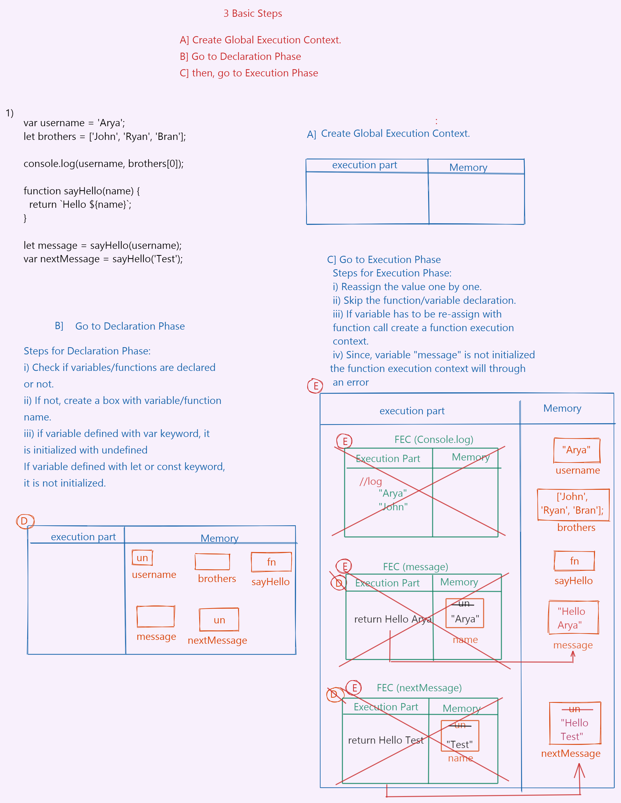

2.

```js
console.log(username, numbers);

var username = 'Arya';
let number = 21;

function sayHello(name) {
  return `Hello ${name}`;
}

let message = sayHello(username);
var nextMessage = sayHello('Test');
```
```js
// Declaration Phase
username = undefined;
number;
sayHello = function;
message;
nextMessage = undefined;

// Execution Phase

  // FEC (console.log) (DP)
  username = undefined;
  number;
  // FEC (console.log) (EP)
  error : cannot access number before initialization

unsername = "Arya"
number = 21;

message = sayHello function call
  //  FEC(sayHello) (DP)
    name = undefined;

  //  FEC(sayHello) (EP)
    name = "Arya"
    return "Hello Arya"

message = "Hello Arya"

nextMessage = sayHello function call
  //  FEC(sayHello) (DP)
  name = undefined;

  //  FEC(sayHello) (EP)
  name = "Test"
  return "Hello Test"

nextMessage = "Hello Test"

```
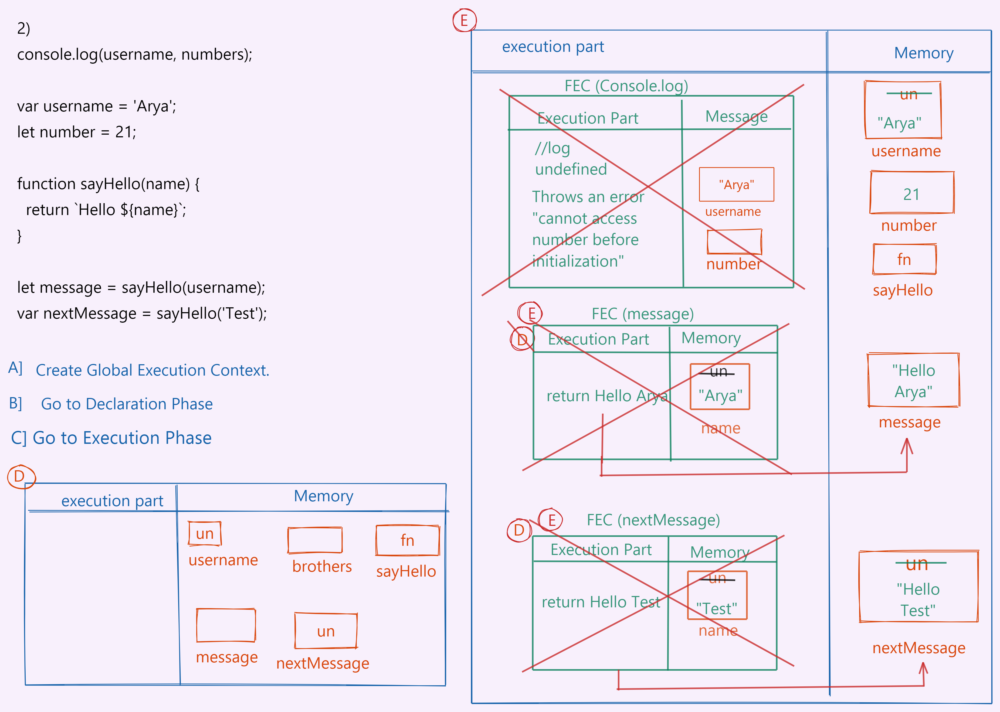

3.

```js
console.log(username, numbers);

let username = 'Arya';
let number = 21;

let sayHello = function (name) {
  return `Hello ${name}`;
};

let message = sayHello(username);
var nextMessage = sayHello('Test');
```
```js
// Declaration Phase
username;
number;
sayHello;
message;
nextMessage = undefined;

// Execution Phase

  // FEC (console.log) (DP)
  username;
  number;
  // FEC (console.log) (EP)
  error : cannot access username before initialization

unsername = "Arya"
number = 21;
sayHello = fn;

message = sayHello function call
  // FEC(sayHello) (DP)
  name = undefined;

  // FEC(sayHello) (EP)
  name = "Arya"
  return "Hello Arya"

message = "Hello Arya"

nextMessage = sayHello function call
  // FEC(sayHello) (DP)
  name = undefined;

  //  FEC(sayHello) (EP)
  name = "Test"
  return "Hello Test"

nextMessage = "Hello Test"

```
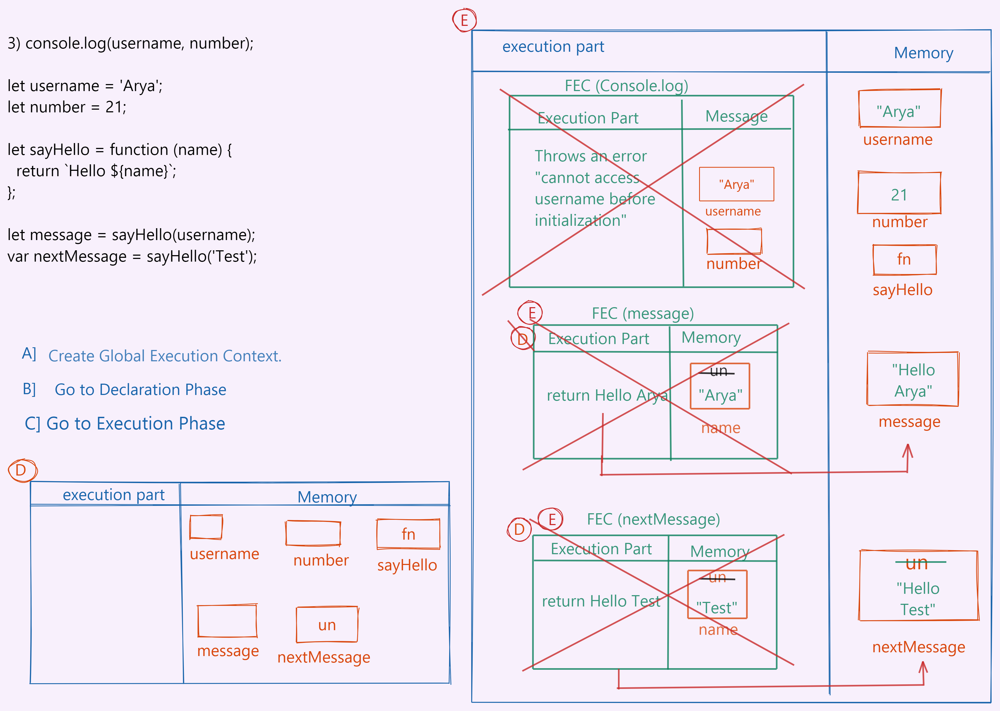

4.

```js
let username = 'Arya';
console.log(username, numbers);

let number = 21;
let message = sayHello(username);

let sayHello = function (name) {
  return `Hello ${name}`;
};

var nextMessage = sayHello('Test');
```
```js
// Declaration Phase
username;
number;
message;
sayHello;
nextMessage = undefined;

// Execution Phase
username = "Arya";

    // FEC (console.log) (DP)
    username = "Arya";
    number;
    // FEC (console.log)(EP)
    error : number is not defined 

number = 21;
message = sayHello function call
    // FEC(sayHello)(DP)
    sayHello;
    // FEC(sayHello)(EP)
    error : sayHello not defined

sayHello = fn;
nextMessage = sayHello function call

    // FEC(sayHello)(DP)
    name = undefined
    // FEC(sayHello)(EP)
    name = "Test"
    return "Hello Test"

nextMessage = "Hello Test"
```
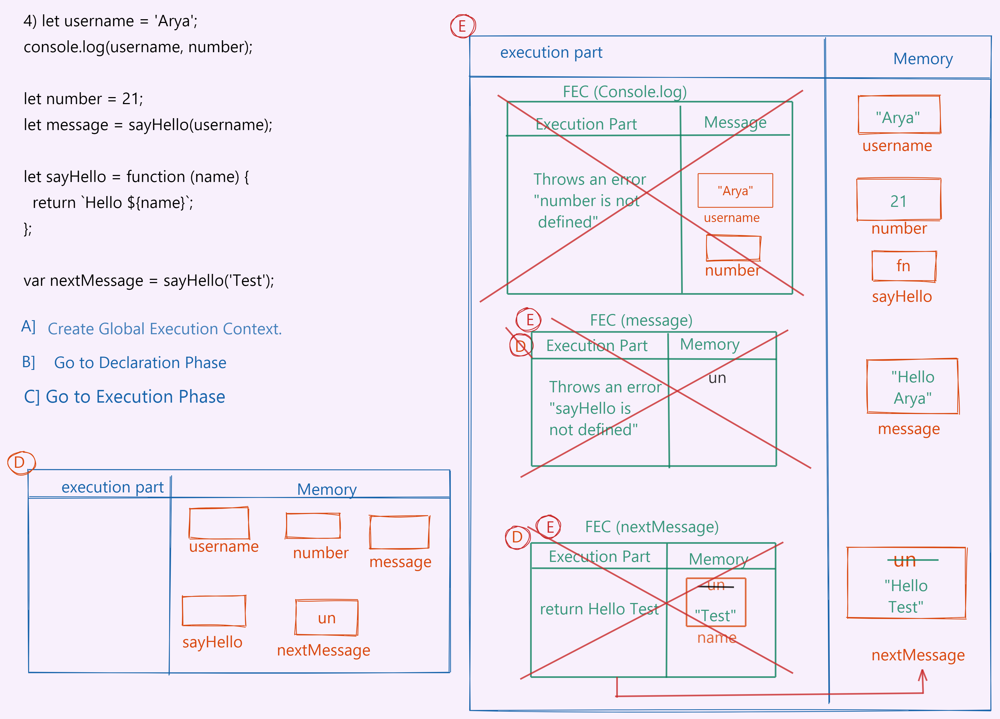

5.

```js
console.log(name);
console.log(age);
var name = 'Lydia';
let age = 21;
```
```js
// Declaration Phase
name = undefined;
age;

// Execution Phase

    // FEC (console.log) (DP)
    name = undefined;
    // FEC(sayHello)(EP)
    log undefined

    // FEC (console.log) (DP)
    age;
    // FEC(sayHello)(EP)
    error : age not defined;

name = "Lydia"
age = 21;

```
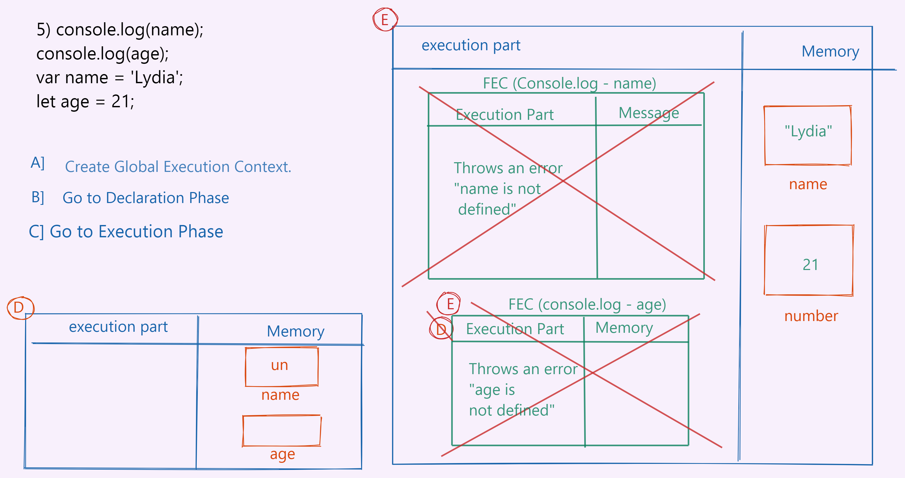

6.

```js
function sayHi(name) {
  console.log(name);
  console.log(age);
  var name = 'Lydia';
  let age = 21;
}

sayHi();
```
```js
// Declaration Phase
sayHi = function;

// Execution Phase

    // FEC(sayHi)(DP)
    name = undefined;
    age;
    // FEC(sayHi)(EP)
        //FEC (console.log)(DP)
        name = undefined; 
        //FEC (console.log)(EP)
        log undefined

        //FEC (console.log)(DP)
        age; 
        //FEC (console.log)(EP)
        error : cannot access "age" before initialization

name = "Lydia"
age = 21    
    

```
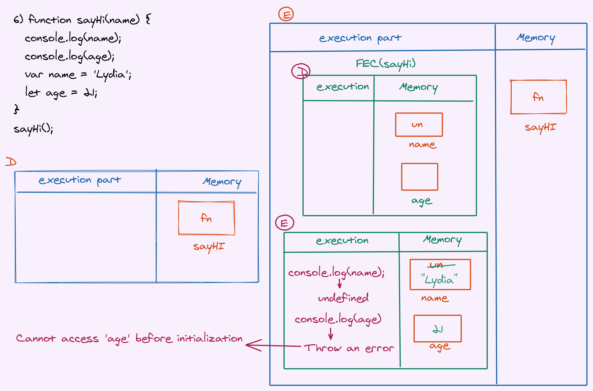

7.

```js
sayHi();
function sayHi(name) {
  console.log(name);
  console.log(age);
  var name = 'Lydia';
  let age = 21;
}
```
```js
// Declaration Phase
sayHi = function;

// Execution Phase
    
    // FEC(sayHi)(DP)
    name = undefined;
    age;
    // FEC(sayHi)(EP)
        //FEC (console.log)(DP)
        name = undefined; 
        //FEC (console.log)(EP)
        log undefined

        //FEC (console.log)(DP)
        age; 
        //FEC (console.log)(EP)
        error : cannot access "age" before initialization

name = "Lydia"
age = 21    
    


```
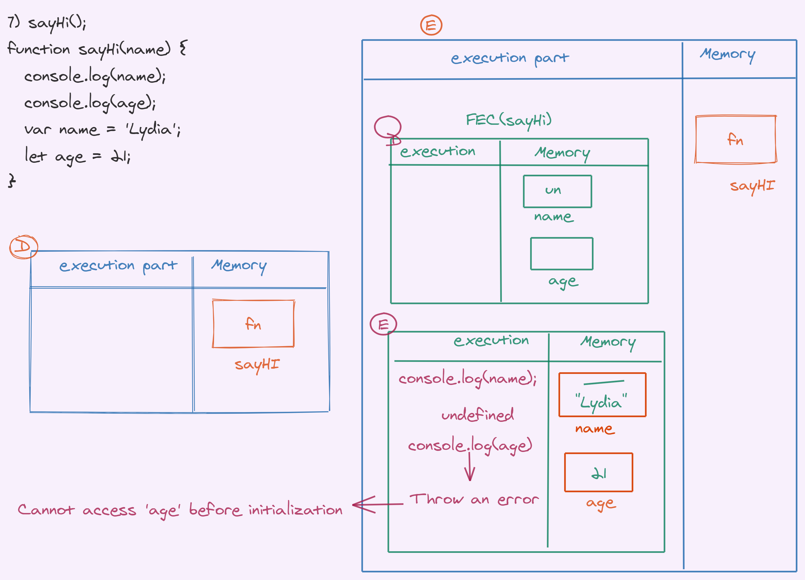

8.

```js
sayHi();
let sayHi = function sayHi(name) {
  console.log(name);
  console.log(age);
  var name = 'Lydia';
  let age = 21;
};
```
```js
// Declaration Phase
sayHi;

// Execution Phase
    // FEC (sayHi) (DP)
    sayHi
    // FEC(sayHi)(EP)
    error : sayHi is not defined
```
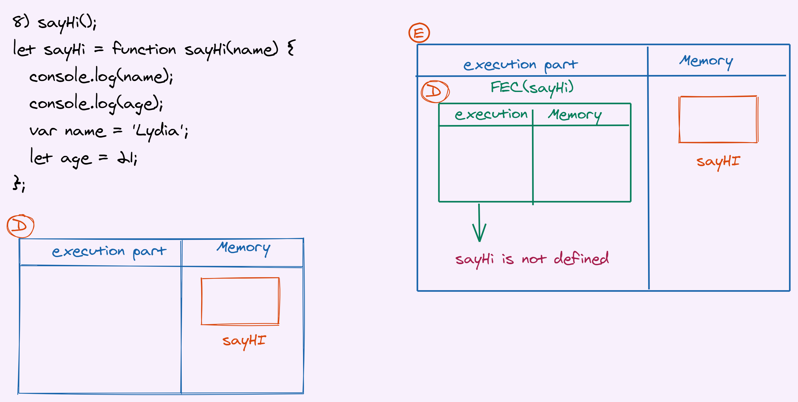

9.

```js
let num1 = 21;
console.log(sum);
var sum = num1 + num2;
let num2 = 30;
```
```js
// Declaration Phase
num1;
sum = undefined
num2;

// Execution Phase
num1 = 21

      // FEC(consle.log) (DP)
      sum = undefined
       // FEC(consle.log) (EP)
       log undefined
sum = error: num2 is not defined

num2 = 30

```
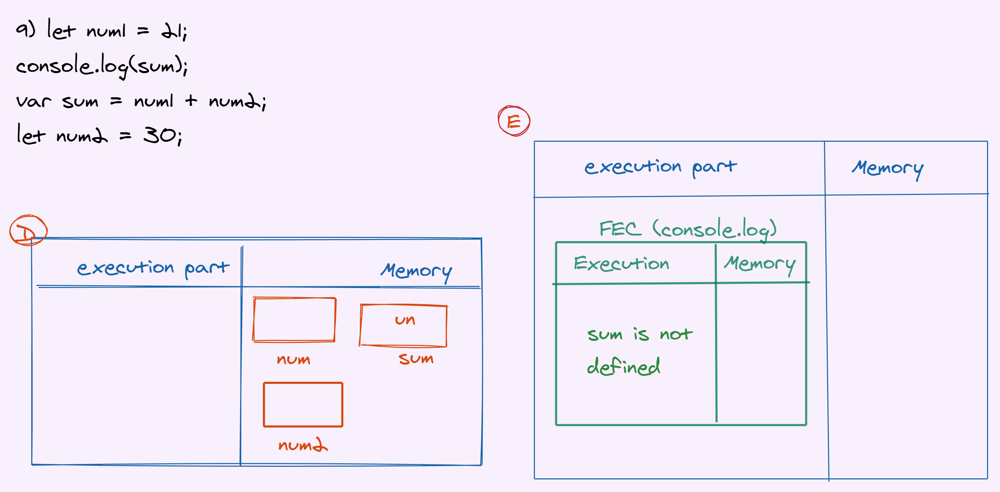

10.

```js
var num1 = 21;

let sum2 = addAgain(num1, num2, 4, 5, 6);

let add = (a, b, c, d, e) => {
  return a + b + c + d + e;
};
function addAgian(a, b) {
  return a + b;
}
let num2 = 200;

let sum = add(num1, num2, 4, 5, 6);
```
```js
// Declaration Phase
num1 = undefined;
sum2;
add;
addAgain = function;
num2;
sum;

// Execution Phase
num1 = 21;
sum2 = addAgain function call
    // FEC(addAgain)(DP)
    a = undefined;
    b = undefined;
    // FEC(addAgain)(EP)
    a = 21
    b = num2(which is undefined)

    error: num2 is not defined

add = function
num2 = 200;
sum = add function call
    // FEC(add)(DP)
    a = undefined;
    b = undefined;
    c = undefined;
    d = undefined;
    e = undefined;

    // FEC(add)(EP)
    a = 21;
    b = 200;
    c = 4;
    d = 5;
    e = 6;
    return a + b + c + d + e 
    236
sum = 236;
```
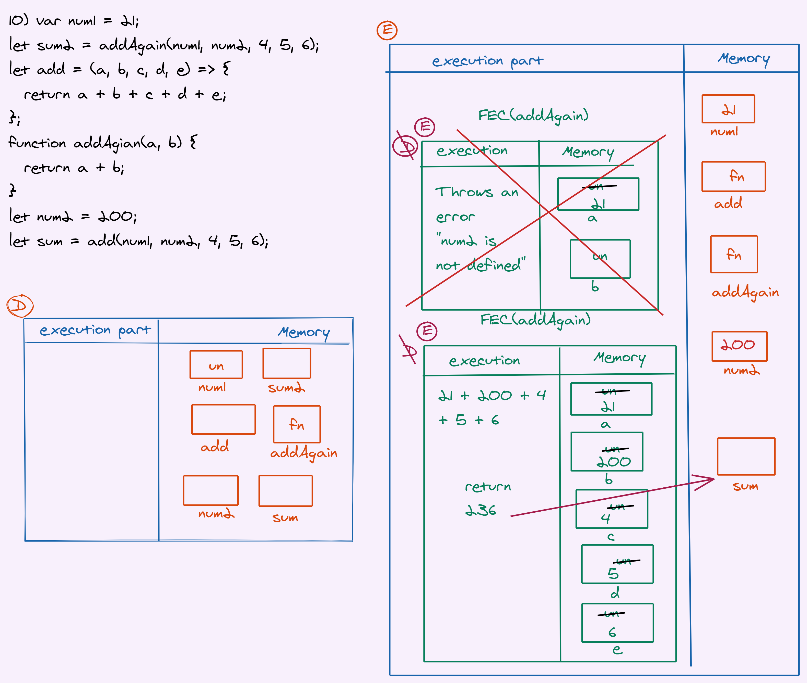

11.

```js
function test(a) {
  let num1 = 21;
  return add(a, num1);
}

let sum = test(100);

let add = (a, b) => {
  return a + b;
};
```
```js
// Declaration Phase
test = function
sum;
add;

// Execution Phase
sum = test function call
    // FEC (test)(DP)
    a = undefined;
    num1;
    // FEC (test)(EC)
    a = 100;
    num1 = 21

    return add()
    error : add is not defined;

add = function

    // FEC (add) (DP)
    a = undefined;
    b = undefined;
    // FEC (add)(EP)
    a = 100
    b = 21
    return 100 + 21 //121

```
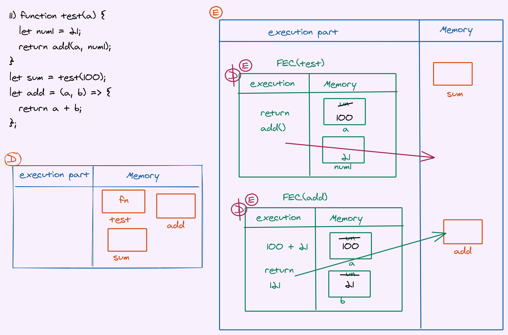

12.

```js
function test(a) {
  let num1 = 21;
  return add(a, num1);
}

let sum = test(100);

function add(a, b) {
  return a + b;
}
```
System Interpretation
```js
// Declaration Phase
test = function
sum;
add = function;

// Execution Phase
sum = test function call
    // FEC (test)(DP)
    a = undefined;
    num1;
    // FEC (test)(EC)
    a = 100;
    num1 = 21

    return add()
    // FEC (add) (DP)
    a = undefined;
    b = undefined;
    // FEC (add)(EP)
    a = 100
    b = 21
    return 100 + 21 //121
sum = 121;
    
```
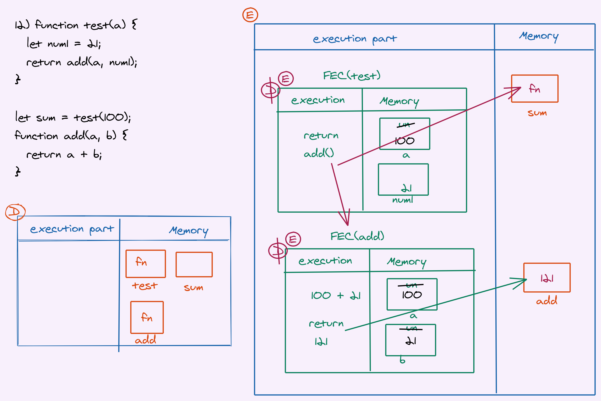
